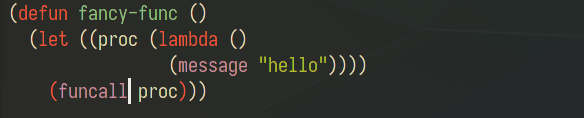
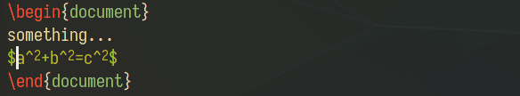
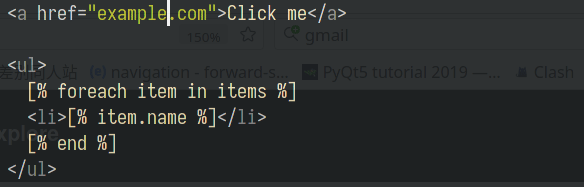
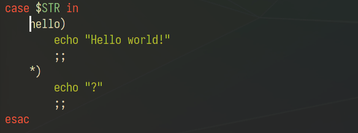

# Puni

<p align="center">
  
</p>

<p align="center"><i>Parentheses Universalistic</i></p>

## What is it?

### A set of soft deletion commands

Puni contains commands for soft deletion, which means deleting while keeping
parentheses (or other delimiters, like html tags) balanced. Let's see them in
action:

Kill lines softly in Lisp code (`emacs-lisp-mode`):



In LaTeX document (`tex-mode`):



In HTML template (`web-mode`):



Look how it kills softly inside/between/out of tags.

In shell script (`sh-mode`):



Puni knows the `)` is just a suffix of a condition, not a closing delimiter.

### A factory of soft deletion commands

That's not the whole story. Puni offers a simple yet powerful API,
`puni-soft-delete-by-move`, for you to define soft delete commands in a style
that fits your need and taste.

For example, the default `puni-backward-kill-word` behaves like:

```elisp
(foo bar)|
;; call `puni-backward-kill-word`
(foo |)
```

`|` means the cursor position. If you don't like this, you could define
`my-backward-kill-word` that behaves like:

```elisp
(foo bar)|
;; call `my-backward-kill-word`
(foo |bar)
```

The default `puni-kill-line` behaves like:

```elisp
| foo (bar
       baz)
;; call `puni-kill-line`
|
;; (nothing left)
```

While you can define a `my-kill-line` that's not so greedy:

```elisp
| foo (bar
       baz)
;; call `my-kill-line`
| (bar
       baz)
;; call `my-kill-line` again
|
;; (nothing left)
```

It's very easy to define commands like this. I'll show you how to do this
later.

### Out of box support for many major modes

That's still not the whole story. Let me reveal the ultimate truth of Puni,
hang tight...

There are *absolutely no language-specific logic* inside Puni!

Wait, it can't be! Or how does it support `web-mode` and `tex-mode`?

Well, it turns out Emacs has a built-in function that knows what is a balanced
expression (or, a sexp): `forward-sexp`. If we call `forward-sexp` until it
throws an error, we know we've hit the boundary, so it's safe to delete until
this position. Try this in some Lisp code:

```elisp
(foo |bar)
;; call `forward-sexp`
(foo bar|)
;; call `forward-sexp`
(foo bar|) ;; (Signals an error)
```

A major mode can provide a `forward-sexp-function`. Ideally, it should work
like the built-in `forward-sexp`, but unfortunately, many of these
`forward-sexp-function`s have all sorts of problems, with the prominent one
being jumping out of current sexp to search for a start/end of a sexp. For
example, in web-mode:

```html
<|p>foo</p>
<!-- call `forward-sexp` -->
<p>|foo</p>
<!-- what we really want -->
<p|>foo</p>
```

Puni fixes the behavior of these `forward-sexp-functions` in a generic way, by:

- Consecutively call `forward-sexp`, in different directions
- Syntax table
- Common sense

So we get `puni-strict-forward-sexp` and `puni-strict-backward-sexp`. These are
"strict" versions of the `forward-sexp` fucntion available in current major
mode, which means they move forward one sexp at a time, and stops at the
boundary. This is the "ideal" `forward-sexp` function, and forms the basis of
all our soft deletion commands.

By taking this appraoch, Puni supports many major modes out of the box.

And that really is the whole story ;)

## Quick start

1. Clone this repository:

   ```
   $ git clone https://github.com/AmaiKinono/puni.git /path/to/puni/
   ```

2. Add the path to your `load-path` in your Emacs configuration:

   ```elisp
   (add-to-list 'load-path "/path/to/puni/")
   ```

3. Require `puni` in your config:

   ```elisp
   (require 'puni)
   ```

4. `puni-mode` offers keybindings for some pre-defined soft delete commands.
   You can enable `puni-global-mode` to enable them everywhere, and add
   `puni-disable-puni-mode` to mode hooks where you don't want to use Puni:

   ```elisp
   (puni-global-mode)
   (add-hook 'term-mode-hook #'puni-disable-puni-mode)
   ```

   Or you can enable `puni-mode` only for programming and structured markup
   languages:

   ```elisp
   (dolist (hook '(prog-mode sgml-mode nxml-mode tex-mode))
     (add-hook hook #'puni-mode))
   ```

Here are 2 configuration examples using `use-package`:

```elisp
;; Use puni-mode globally and disable it for term-mode.
(use-package puni
  :defer t
  :init
  ;; The autoloads of Puni are set up so you can enable `puni-mode` or
  ;; `puni-global-mode` before `puni` is actually loaded. Only after you press
  ;; any key that calls Puni commands, it's loaded. Besides, the
  ;; `puni-soft-delete-by-move` API can also be used before Puni is loaded.
  (puni-global-mode)
  (add-hook 'term-mode-hook #'puni-disable-puni-mode))

;; Use puni-mode only for certain major modes.
(use-package puni
  :defer t
  :init
  (dolist (hook '(prog-mode sgml-mode nxml-mode tex-mode))
    (add-hook hook #'puni-mode)))
```

## Commands

### Deletion commands

First we have some "delete by move" commands:

| Command                     | Default keybinding |
|-----------------------------|--------------------|
| `puni-forward-delete-char`  | `C-d`              |
| `puni-backward-delete-char` | `DEL`              |
| `puni-forward-kill-word`    | `M-d`              |
| `puni-backward-kill-word`   | `M-DEL`            |
| `puni-kill-line`            | `C-k`              |
| `puni-backward-kill-line`   | `C-S-k`            |

When there is an active region, these commands all try to delete/kill that
region instead. If it will cause an unbalanced state, Puni asks you to confirm.

You can also call `puni-kill-active-region` directly. It's bind to `C-w`.

`puni-force-delete` (`C-c DEL`) is for deleting the char before point, or the
active region, no matter they are balanced or not. This is handy if you break
the syntax structure by accident, and Puni doesn't allow you to delete
something.

### Navigation commands

We have some "navigate by sexp" commands:

| Command                  | Default keybinding |
|--------------------------|--------------------|
| `puni-forward-sexp`      | `C-M-f`            |
| `puni-backward-sexp`     | `C-M-b`            |
| `puni-beginning-of-sexp` | `C-M-a`            |
| `puni-end-of-sexp`       | `C-M-e`            |

These are similar to their built-in versions, but based on Puni's "strict
forward/backward sexp" functions, so the behavior is more predictable, and
won't take you out of current sexp.

When you do want to get out of/into a sexp, we have:

| Command                         | Default keybinding |
|---------------------------------|--------------------|
| `puni-syntactic-forward-punct`  | `M-(`              |
| `puni-syntactic-backward-punct` | `M-)`              |

These commands basically takes you to the next/previous punctuation, but it
does more than that to give you a "syntactical navigating" feel. See their
docstrings for detail.

## Define your own commands

The API for this is `puni-soft-delete-by-move`. Let's see the definition of
`puni-kill-line`. Notice the comments about arguments of
`puni-soft-delete-by-move`:

``` elisp
(defun puni-kill-line ()
  "Kill a line forward while keeping expressions balanced."
  (interactive)
  ;; Kill active region if there is one.
  (if (use-region-p)
      (puni-kill-active-region)
    (and
     (puni-soft-delete-by-move
       ;; FUNC: `puni-soft-delete-by-move` softly deletes the region from
       ;; cursor to the position after calling FUNC.
       (lambda ()
         (if (eolp) (forward-line) (end-of-line)))
       ;; STRICT-SEXP: More on this later.
       'strict-sexp
       ;; STYLE: More on this later.
       'beyond
       ;; KILL: Save deleted region to kill-ring if non-nil.
       'kill
       ;; FAIL-ACTION argument is not used here.
       )
     ;; Reindent after kill
     (when (not (puni--line-empty-p))
       (save-excursion (indent-according-to-mode))))))
```

### `strict-sexp`

If `strict-sexp` is non-nil, symbols are treated as sexps, even if they are
actually delimiters. For example, in `ruby-mode`:

```ruby
|def func
    puts "Hello"
end
# call `puni-kill-line`
|
# (nothing left)
```

Let's change `strict-sexp` to nil:

```ruby
|def func
    puts "Hello"
end
# call `puni-kill-line`
|
    puts "Hello"
end
```

### `style`

The default style of `puni-kill-line` is `beyond`. It means deleting sexps
until no more to delete, or we've reached a position after the line end. For
example:

```elisp
| foo (bar
       baz)
;; call `puni-kill-line`
|
;; (nothing left)
```

The `within` style is basically the same, but it stops before the line end:

```elisp
| foo (bar
       baz)
;; call `puni-kill-line`
|(bar
       baz)
;; call `puni-kill-line`
|(bar
       baz)
;; (nothing happened, as the line end is inside the next sexp)
```

We can combine `within` style with `fail-action` being `delete-one`, so when
there's no complete sexp before the line end to delete, it deletes one sexp
forward:

```elisp
| foo (bar
       baz)
;; call `puni-kill-line`
|(bar
       baz)
;; call `puni-kill-line`
|
;; (nothing left)
```

The `precise` style means deleting until the line end, but only when the part
between the cursor and line end is balanced:

```elisp
|(foo bar)
;; call `puni-kill-line`
|
;; (nothing left)

;; another situation:
|(foo
  bar)
;; call `puni-kill-line`
|(foo
  bar)
;; (nothing happened)
```

This style is more useful for deletion in smaller regions, like word and char.

### `fail-action`

This argument decides what to do if nothing can be deleted according to
`style`. Let's take `puni-backward-kill-word` as an example, its `style` is
`precise`. So in this example:

``` elisp
(foo bar)|
```

It can't delete anything.

If `fail-action` is nil, it does nothing.

If `fail-action` is `delete-one`, it deletes backward one sexp:

```elisp
|
;; (nothing left)
```

If `fail-action` is `jump`, it jumps to the beginning of the previous word:

```elisp
(foo |bar)
```

If `fail-action` is `jump-and-reverse-delete` (the one used by
`puni-backward-kill-word`), it jumps to the the beginning of the previous word,
and soft delete from here to the previous cursor position (the line end in this
case), with `style` being `within`:

```elisp
(foo |)
```

### Conclusion

`puni-soft-delete-by-move` is a simple API for defining soft deletion commands.
It has 2 key arguments: `style` decides which part to delete, and `fail-action`
decides what to do if nothing can be deleted. By combining these 2 arguments,
you can create soft deletion commands that fits your need and taste.

Be sure to use the implementation of built-in commands as a reference when
defining your own commands!

## Caveats

Let's talk about things that Puni can't do, or doesn't do well.

### Doesn't work well in some major modes

If the `forward-sexp-function` in a major mode has absolutely no idea about a
syntax structure, then Puni can't deal with it. For example, in `html-mode`:

```html
<p>hello|</p>
<!-- call `forward-sexp` -->
<p>hello</p>|
<!-- call `backward-sexp` -->
<p>hello|</p>
```

`html-mode` thinks `</p>` itself is a complete sexp, so Puni will just happily
delete it:

```html
<p>hello|</p>
<!-- call `puni-kill-line` -->
<p>hello
```

`xml-mode` and `web-mode` doesn't have this problem.

In general, it's still safe to enable `puni-mode` everywhere, as even if a
major mode doesn't implement its own `forward-sexp-function`, the built-in one
(that works well with Lisp) is used as a fallback, which works for brackets
(`()`, `[]`, `{}`) and strings. For many languages, this is enough. Besides, we
can always use `puni-force-delete` to temporarily get rid of the restrictions
set up by Puni.

It's worth noting that Emacs comes with a great indentation engine called
[SMIE](https://www.gnu.org/software/emacs/manual/html_node/elisp/SMIE.html).
With it, a major mode can provide a table of grammar rules, and get:

- reliable auto-indentation
- a `forward-sexp-function`, which is what Puni needs.

There are many major modes using SMIE, like `ruby-mode`, `sh-mode` and
`css-mode`. As SMIE is being used in a growing number of major modes, they get
support from Puni, for free.

### Lack of auto pairing

Puni doesn't support auto pairing, as I haven't found a way to implement it
in a generic way. If you have any idea about this, please tell me!

For now, you can use these for auto pairing:

- `electric-pair-mode`: It's a built-in minor mode that automatically close
  your opening brackets. Its default behavior is carefully designed to keep
  brackets balanced when you insert things. I use this package daily, and I
  love it.

  It's disadvantage is that only single-character brackets (like `(`/`)`,
  `[`/`]`, `"`) are supported. You can't auto close delimiters like `if ... end
  if` or `<p> ... </p>`.

- Some major/minor modes come with their own tools for auto-pairing. For
  example, `web-mode` can auto close html tags, `tex-mode` has
  `latex-close-block` command.

- For major modes using SMIE, there's a `smie-close-block` command.

### Lack of fancy sexp-manipulating commands

Paredit and smartparens have fancy sexp-manipulating commands like slurp, barf,
split, splice, convolute, etc., while Puni doesn't have them.

I found the combination of sexp-browsing commands, soft-deletion commands, and
mark/kill/yank could do almost any fancy sexp manipulations. It also requires
less thinking, and feels more intuitive this way.

## What does "Puni" means anyway?

"punipuni"（ぷにぷに）is a Japanese mimetic word means "soft", "bouncy", or
"pillowy".

If you are surrounded by punipuni things, you feel safe and relieved. That's my
feeling when using Puni: never need to worry about messing up parentheses
anymore.

## Contributing

PRs and issues are welcomed!

But please keep in mind that, due to the unique approach Puni takes, it can't
fix every use case in every language, or we'll end up with a lot of ad-hoc
tricks, which contradicts with the unified approach taken by Puni.

So, before you report a bug of the deletion commands, I'd like you to:

- Make sure you've read README thoroughly, and have at least a vague concept of
  how Puni works.

- Try `forward-sexp` and `backward-sexp` around the thing you want to delete,
  and get an idea of how they understand the syntactic structure around there.

  Here we are talking about the built-in `forward/backward-sexp` commands, not
  `puni-forward/backward-sexp`. When `puni-mode` is enabled, `C-M-f` and
  `C-M-b` are bind to the latter ones.

- Now, if you think there's any hope that it can be solved, post an issue with
  the investigations you've made.

## Donation

If Puni makes you happy, please consider buying me a beer to make me happy ;)

- by Alipay

  

- by Wechat Pay

  

- by [Buy me a coffee](https://www.buymeacoffee.com/amaikinono)
